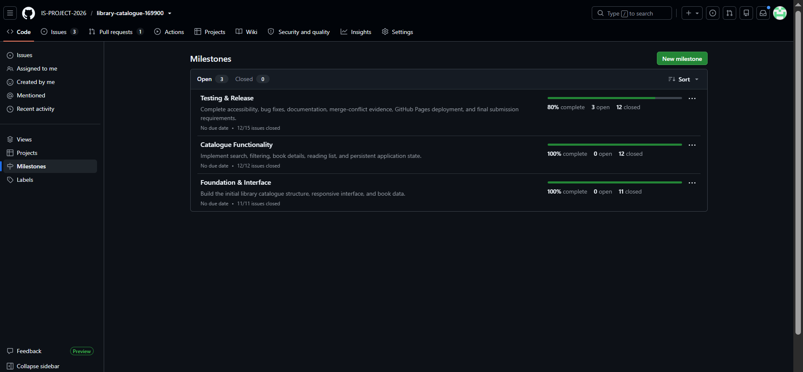
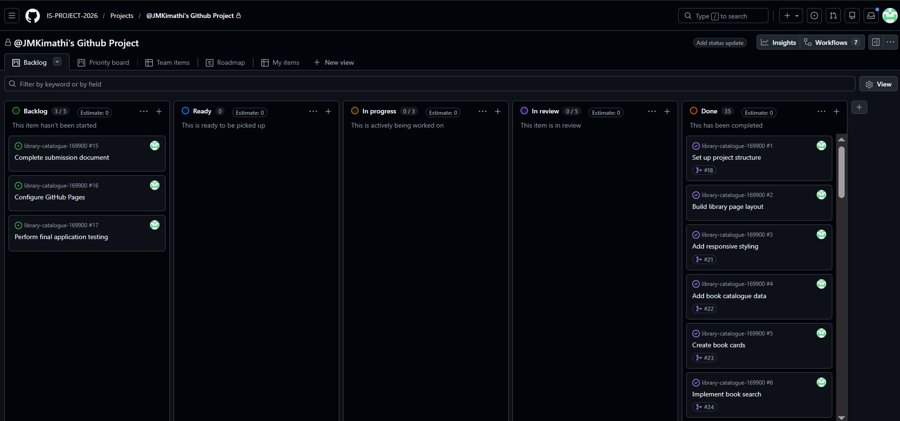
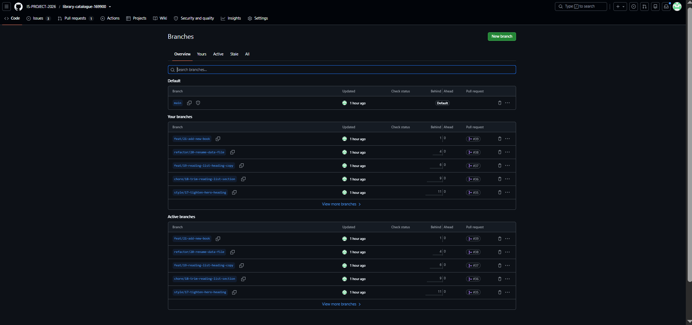
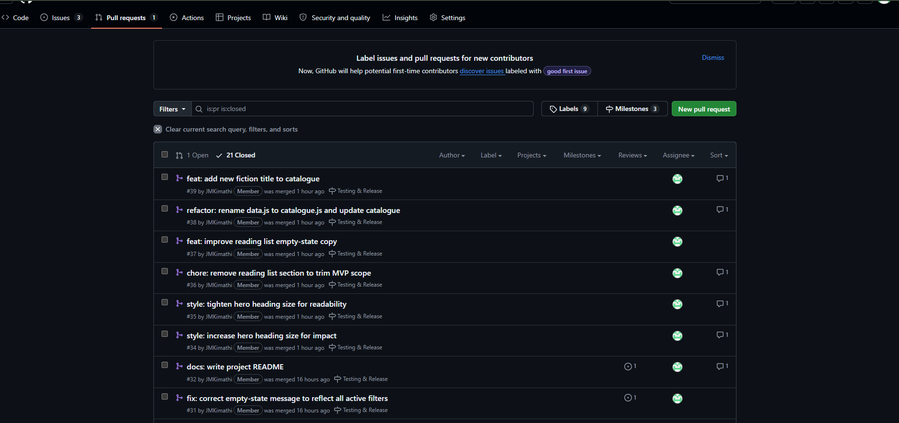
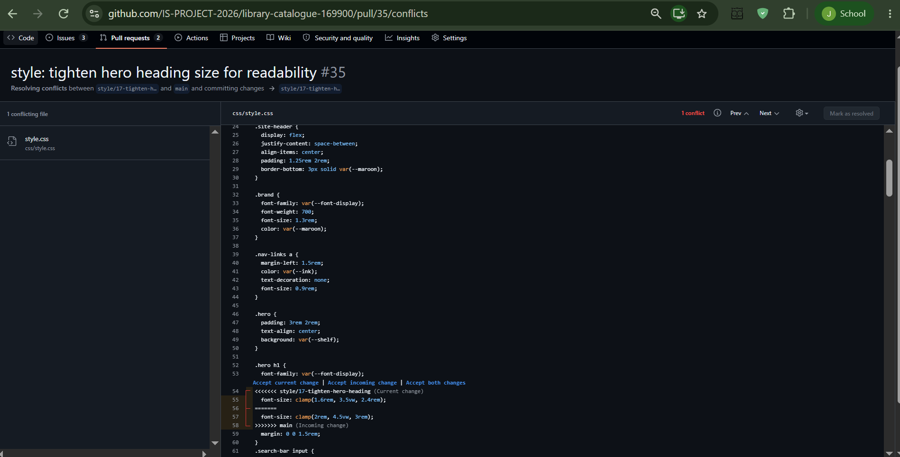
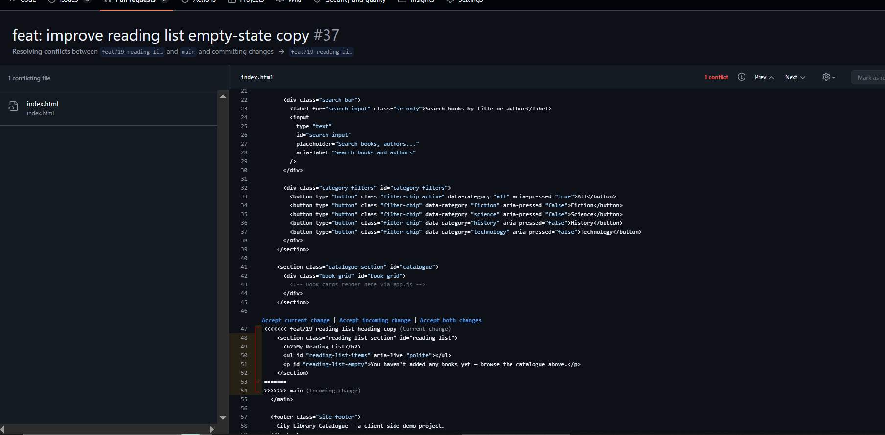
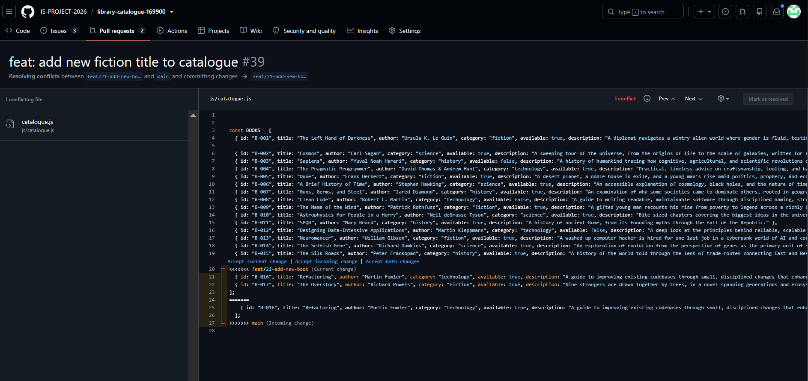

# Project Submission Report

## 1. Student Details

Full Name: John Mwiti Kimathi
GitHub Username: JMKimathi
Email: john.mwiti@strathmore.edu

## 2. Deployed Project Link

Live GitHub Pages URL: https://is-project-2026.github.io/library-catalogue-169900/

## 3. Reflection — Grounded in Your Git History

### A. Your Best Commit

Commit URL: https://github.com/IS-PROJECT-2026/library-catalogue-169900/commit/f52070992d146f03cc2b03f84c5021465cf40246

Why this one? The commit adds a meaningful catalogue feature and follows the project's Conventional Commits format. It is also traceable through the feature branch and pull request workflow.

### B. A Mistake or Struggle

Link to the evidence: https://github.com/IS-PROJECT-2026/library-catalogue-169900/pull/39/commits/31aa2da6edef526251b1ac99e6699592e6e5b43e

What happened and how did you recover? I encountered a merge conflict while integrating the latest changes from `main` into my feature branch. The catalogue data contained competing changes, so I inspected the conflict, removed the duplicate entry, retained the intended new books, and verified the resulting file before completing the merge.

### C. A Pull Request You're Proud Of

PR URL: https://github.com/IS-PROJECT-2026/library-catalogue-169900/pull/39

What did you check before merging? I reviewed the changed catalogue data, resolved the merge conflict, checked that the final array structure was valid, and confirmed that the intended books were present before merging the pull request into `main`.

### D. One Thing You Would Do Differently

What would you change? I would integrate changes from `main` into my feature branch earlier and more frequently to reduce the size and complexity of merge conflicts.

Link to the evidence of the original decision: https://github.com/IS-PROJECT-2026/library-catalogue-169900/pull/39

## 4. Screenshots of Key GitHub Features

### A. Milestones and Issues

Caption: The Testing & Release milestone tracks the final project tasks, with 80% of its issues completed and the remaining work clearly identified.

### B. Project Board

Caption: The Kanban board tracks tasks through Backlog, Ready, In Progress, In Review, and Done, showing the progression of development work and 35 completed issues.

### C. Branching Architecture

Caption: The repository uses isolated feature, refactor, chore, and style branches tied to individual tasks, with pull requests used to merge completed work into the main branch.

### D. Pull Requests & Traceability

Caption: The pull request history demonstrates traceability from feature branches and issues through commits, pull requests, merges, and milestone completion.

## 5. Merge Conflict Evidence

### Conflict 1 — Full Chronology

**Cause:** Same-line edit — two branches independently modified the same CSS property.

**Step 1: Generating the Clash**

Caption: PRs #34 and #35 both modified `.hero h1`'s `font-size`; merging #35 after #34 was already in `main` triggered GitHub's "Can't automatically merge" warning.

**Step 2: Inside the Code Editor (Conflict Markers)**

The conflict markers showed two competing `font-size` values: the feature branch used `clamp(1.6rem, 3.5vw, 2.4rem)`, while `main` contained `clamp(2rem, 4.5vw, 3rem)`.

Caption: The conflict exposed two competing heading sizes, requiring the conflicting CSS values to be reviewed before selecting the intended final styling.

**Step 3: Resolution & Clean Merge**

The conflict was resolved by reconciling the competing heading sizes and completing the merge into `main`.

Caption: The resolved CSS was verified and the pull request was completed successfully after the conflict was addressed.

### Conflict 2 — Different Cause

**Cause:** Delete/modify conflict — one branch removed a section while another edited within it.

**Why does this cause trigger a conflict?**

Git cannot automatically decide whether the deletion or the in-place edit represents the intended final state, since both branches contain valid changes to the same region.

Caption: PR #36 removed the reading-list section from `index.html`, while PR #37 edited its empty-state text; merging #37 after #36 was already in `main` produced a delete/modify conflict.

### Conflict 3 — Different Cause

**Cause:** Overlapping content changes — both branches modified the same catalogue-data region in `js/catalogue.js`.

**Why does this cause trigger a conflict?**

Git could not safely combine the competing changes to the catalogue array automatically. The resolution required manually reconciling the duplicated `B-015` entry and ensuring that the final catalogue contained the intended `B-015`, `B-016`, and `B-017` entries with a single closing bracket.

Caption: The merge exposed competing changes in the catalogue data; the conflict was resolved by removing the duplicate `B-015`, retaining the intended new `B-016` and `B-017` entries, and restoring a single closing bracket.

## 6. Feedback & Evaluation

Anonymous Evaluation Form: [ https://forms.gle/KrT4VxtFtkU3wtYu8]